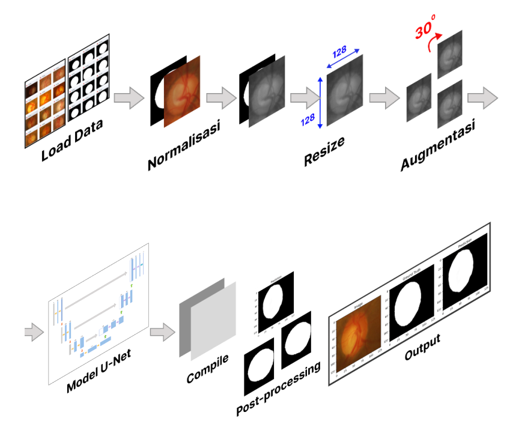
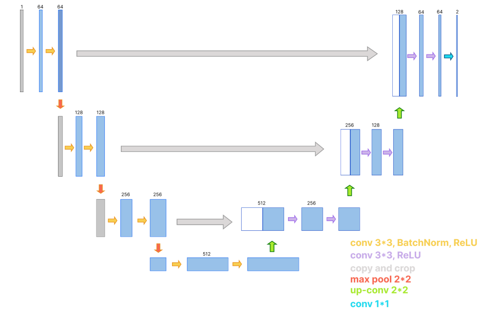

# Optic Disc Segmentation with U-Net 👁️
*Deep Learning for Early Glaucoma Screening from Retinal Fundus Images*

This project trains a **U-Net** model to segment the **optic disc (OD)** in retinal fundus images. Accurate OD segmentation is the first step toward computing the Cup-to-Disc Ratio (CDR), a key biomarker for glaucoma, the "silent thief of sight" and one of the leading causes of irreversible blindness worldwide.

Everything lives in a single Google Colab notebook, `UNet_optic_disc.ipynb`, which covers:
- Data loading & preprocessing: resize to 128×128, pixel normalization, grayscale masks  
- Data augmentation: synchronized image–mask transforms (rotation, shift, zoom, flip, brightness)  
- Model: a U-Net built from scratch in TensorFlow/Keras (encoder, bottleneck, decoder with skip connections)  
- Evaluation: custom IoU and Dice Score metrics, training curves, and side-by-side visualization of *image / ground truth / prediction*  



*Overall segmentation pipeline, from data loading to prediction output.*

## Results

Evaluated on the validation split (20% of the dataset) after 20 epochs:

| Model | Target | IoU | Dice Score | Accuracy |
|-------|--------|-----|------------|----------|
| U-Net | Optic Disc | 0.7535 | 0.8594 | 0.9523 |

Predictions are binarized for visualization with a threshold of 0.45 after min-max normalization (`process_predictions`).

## Dataset

The dataset is private and accessed through Google Drive. It is **not included in this repository**. Expected structure:

```
MyDrive/Optic Disc - Glaucoma/
├── images/      # 50 fundus images (.jpg)
├── masks/       # 50 ground truth OD masks (.png), same filename as the image
└── label.csv    # binary classification labels (not used in this notebook)
```

To use your own data, keep the same structure (each `xxx.jpg` needs a matching `xxx.png` mask) and update `images_path` and `masks_path` in the notebook.

## Model Architecture


*Conceptual U-Net diagram. See the table below for the exact configuration used in the notebook.*

| Stage | Details |
|-------|---------|
| Input | 128 × 128 × 3 |
| Encoder | 3 blocks of 2× Conv2D (3×3, ReLU) with 64 → 128 → 256 filters, each followed by 2×2 max pooling; Dropout (0.1) in the first block |
| Bottleneck | 2× Conv2D (3×3, ReLU), 512 filters |
| Decoder | 3 blocks of Conv2DTranspose (2×2, stride 2) + skip-connection concatenation + 2× Conv2D, 256 → 128 → 64 filters |
| Output | Conv2D (1×1) with sigmoid, giving a binary OD mask |

**Training setup:** Adam optimizer, binary cross-entropy loss, batch size 8, 20 epochs, 80/20 train–validation split (`random_state=42`).

## How to Run

1. Upload `UNet_optic_disc.ipynb` to [Google Colab](https://colab.research.google.com/) (a GPU runtime is recommended, training on CPU took ~3 minutes per epoch in our run).
2. Put your dataset in Google Drive using the structure above.
3. Update `images_path` and `masks_path` if your folder location differs.
4. Run all cells. The notebook will:
   - mount Google Drive,
   - train the U-Net and save it as `unet_model.h5`,
   - plot loss, accuracy, IoU, and Dice curves,
   - visualize 10 validation predictions.

**Requirements:** Python 3, `tensorflow`, `numpy`, `scikit-learn`, `scikit-image`, `matplotlib` (all preinstalled on Colab except possibly `scikit-image`).

## Project Structure

```
.
├── UNet_optic_disc.ipynb   # data loading, augmentation, U-Net, training, evaluation
└── README.md
```

## Limitations

- **Small dataset:** only 50 images (40 for training, 10 for validation), so generalization to real clinical data is limited and results may be unstable between epochs.
- **Optic disc only:** the notebook segments the OD. Optic cup segmentation, CDR calculation, and glaucoma classification are **not implemented yet** (they are future work).
- **No separate test set:** the reported metrics come from the validation split used during training.
- **Limited hardware:** trained on a standard laptop-class environment, which restricted model size and hyperparameter tuning.
- **Single-source data:** the model has not been validated on external datasets (e.g., REFUGE, Drishti-GS), so robustness to different cameras and lighting is unknown.

## Future Work

- Add optic cup segmentation and compute the CDR automatically
- Train on larger and more diverse datasets, and validate on external ones
- Try U-Net variants (Attention U-Net, residual U-Net, UNet++)
- Use the native Keras format (`.keras`) instead of legacy `.h5`

**NOTE**
- this project runs in **Google Colab** and expects the dataset in Google Drive.
- ⚠️ **this project is a student research prototype and not a medical diagnostic tool. results are for educational purposes only. for real diagnosis, please consult an ophthalmologist.**

collaborators 👥:
-   [github.com/Nilawahyusaputri](https://github.com/Nilawahyusaputri)
-   [github.com/najwazr](https://github.com/najwazr)
